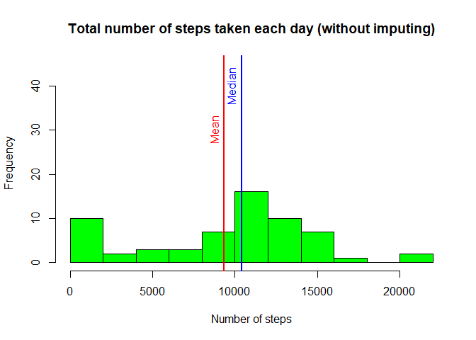
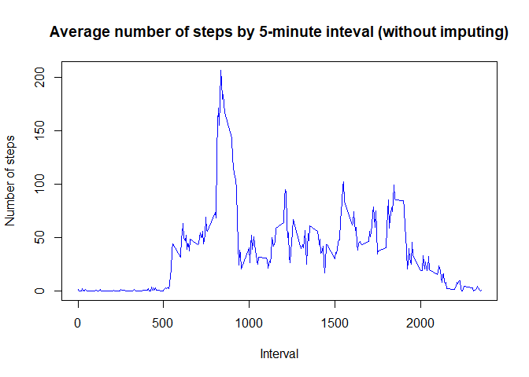
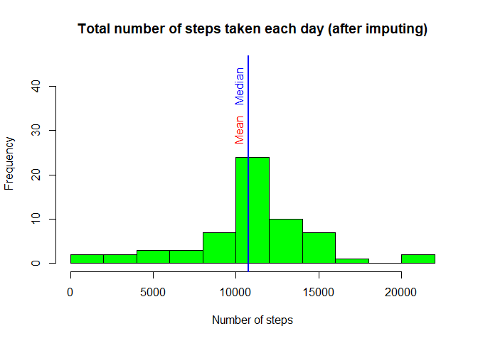

## Loading and preprocessing the data


```r
## Dependencies
library(dplyr)
library(tidyr)
library(lattice)

# Set constants
zippedFileName <- "activity.zip"
unzippedFileName <- "activity.csv"

## Unzipping the raw data file
unzip(zippedFileName)

## Read the dataset
activity <- read.csv(unzippedFileName, colClasses = c("integer", "factor", "factor"))
```

- The code depends on the following three libraries: **dplyr**, **tidyr** and **lattice**

## What is mean total number of steps taken per day?


```r
## Calculate the daily totals ignoring NA values
dailyTotal <- with(activity, tapply(steps, date, function(x) {sum(x, na.rm = TRUE)}))

## Plot the histogram of the total number of steps taken each day (without imputing)
par(mfrow = c(1, 1))
hist(dailyTotal, breaks = 8, col = "green", main = "Total number of steps taken each day (without imputing)",
     ylim = c(0, 45), xlab = "Number of steps")

## Calculate the mean and median of the total number of steps taken per day and plot them
meanDaily <- mean(dailyTotal)
abline(v = meanDaily, col = "red", lwd = 2)
text(meanDaily - 650, 30, "Mean", col = "red", srt = 90)
medianDaily <- median(dailyTotal)
abline(v = medianDaily, col = "blue", lwd = 2)
text(medianDaily - 650, 40, "Median", col = "blue", srt = 90)
```

<!-- -->

- The mean of the total number of steps taken per day is ***9354***  
- The median of the total number of steps taken per day is ***10395***

## What is the average daily activity pattern?


```r
## Calculate the average number of steps taken for each 5-minute interval
intervalAverage <- with(activity, tapply(steps, interval, function(x) {mean(x, na.rm = TRUE)}))
interval <- as.integer(rownames(intervalAverage))
intervalAverage <- intervalAverage %>%
  data.frame() %>%
  mutate(interval = interval) %>%
  arrange(interval)
colnames(intervalAverage) <- c("average", "interval")

## Calculate the interval that contains the maximum number of steps
maxInterval <- intervalAverage[which.max(intervalAverage$average), "interval"]
maxHours <- as.integer(maxInterval / 100)
maxMinutes <- maxInterval - maxHours * 100

## Make a time series plot of the 5-minute interval vs the average number of steps taken
with(intervalAverage, plot(interval, average, type = "l", col = "blue",
                           main = "Average number of steps by 5-minute inteval (without imputing)",
                           xlab = "Interval", ylab = "Number of steps"))
```

<!-- -->

- The 5-minute interval which contains the maximum number of steps, on average across all the days in the dataset, is ***835***, which corresponds to the time of ***8:35***

## Imputing missing values


```r
## Calculate and report the total number of missing values in the dataset
missingValues <- is.na(activity)
totalMissingValues <- apply(missingValues, 2, sum)
totalMissingSteps <- totalMissingValues[1]

## Create a new dataset with imputing
hours <- as.integer(intervalAverage$interval / 100)
minutes <- intervalAverage$interval - hours * 100
index <- as.integer(hours * 12 + minutes %/% 5 + 1)
activityImputed <- activity
activityImputed[missingValues[, "steps"], "steps"] <- as.integer(round(intervalAverage$average[index]))

## Calculate the daily totals (after imputing)
dailyTotalImputed <- with(activityImputed, tapply(steps, date, function(x) {sum(x, na.rm = TRUE)}))

## Plot the histogram of the total number of steps taken each day (after imputing)
hist(dailyTotalImputed, breaks = 8, col = "green", main = "Total number of steps taken each day (after imputing)",
     ylim = c(0, 45), xlab = "Number of steps")

## Calculate the mean and median of the total number of steps taken per day and plot them (after imputing)
meanDailyImputed <- mean(dailyTotalImputed)
deltaMean <- meanDailyImputed - meanDaily
abline(v = meanDailyImputed, col = "red", lwd = 2)
text(meanDailyImputed - 650, 30, "Mean", col = "red", srt = 90)

medianDailyImputed <- median(dailyTotalImputed)
deltaMedian <- medianDailyImputed - medianDaily
abline(v = medianDailyImputed, col = "blue", lwd = 2)
text(medianDailyImputed - 650, 40, "Median", col = "blue", srt = 90)
```

<!-- -->

- The total number of missing values in the dataset (i.e. the total number of rows with NAs) is ***2304***  
- To fill the missing values in the dataset (number of steps), the average across all the days for that 5-minute interval (rounded to zero decimal places) was used  
- After imputing, the mean of the total number of steps taken per day is ***10766***  
- After imputing, the median of the total number of steps taken per day is ***10762***  
- Both mean and median differ from the estimates from the first part of the assignment  
- The difference between the new mean and the old mean is ***1411***  
- The difference between the new median and the old median is ***367***

## Are there differences in activity patterns between weekdays and weekends?


```r
## Create a new factor variable indicating whether a given date is a weekday or weekend day
activityImputed <- activityImputed %>%
  mutate(factorWeekdayWeekend = factor(ifelse(weekdays(as.Date(activityImputed$date)) %in% c("Saturday",
                                                                                             "Sunday"),
                                              "weekend", "weekday")))

## Calculate the average number of steps taken for each 5-minute interval for each subset
intervalAverageImputed <- with(activityImputed,
                               tapply(steps, list(factor1 = factorWeekdayWeekend, factor2 = interval),
                                      function(x) {mean(x, na.rm = TRUE)}))
intervalAverageImputed <- data.frame(t(intervalAverageImputed))
intervalImputed <- as.integer(rownames(intervalAverageImputed))

intervalAverageImputed <- intervalAverageImputed %>%
  mutate(interval = intervalImputed) %>%
  gather(factorWeekdayWeekend, average, -interval) %>%
  mutate(factorWeekdayWeekend = as.factor(factorWeekdayWeekend)) %>%
  arrange(factorWeekdayWeekend, interval)

## Make a time series plot of the 5-minute interval vs the average number of steps taken by weekday/weekend
xyplot(average ~ interval | factorWeekdayWeekend, data = intervalAverageImputed, type = "l",
            layout = c(1, 2), xlab = "Interval", ylab = "Number of steps")
```

<!-- -->

- There are significant differences in activity patterns between weekdays and weekends, for example on average on weekdays the number of steps during working hours is low, while on weekends it is more constant throughout the entire day
